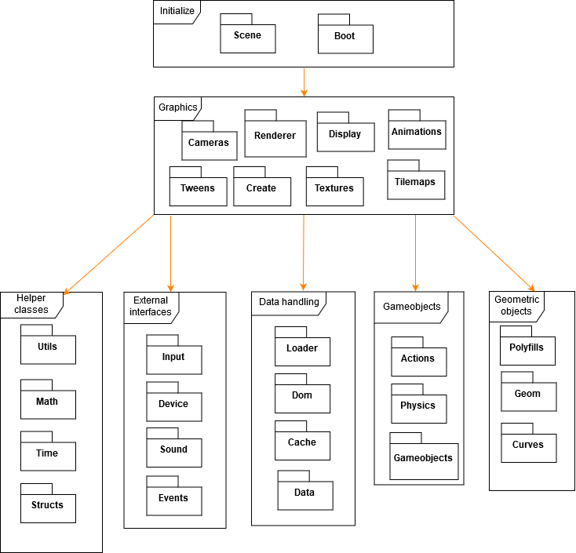
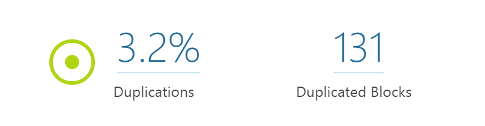
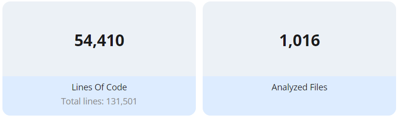
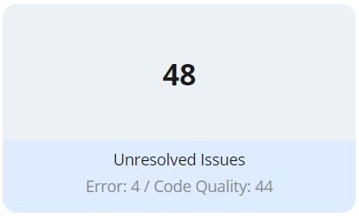
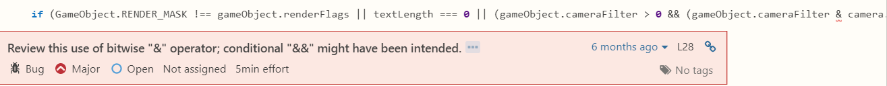

# Phaser - A Fun, Free and Fast 2D Game Framework for HTML5 browser games supporting Canvas and WebGL rendering.

**[Gerard van Alphen](https://github.com/ger1995),
[Tom Catshoek](https://github.com/TCatshoek),
[Tomas Heinsohn Huala](https://github.com/Tomas2h),
and
[Casper van Wezel](https://github.com/12casper3).**

_Delft University of Technology_


## Abstract
<!-- Explain briefly what Phaser is. -->
TODO[cw]:

<!-- Explain briefly what this chapter is about. -->
TODO[cw]:

## Table of Contents

1. [Introduction](#introduction)
2. [Stakeholders Analysis](#stakeholders-analysis)
3. [Context View](#context-view)
4. [Development View](#development-view)
5. [Technical Debt](#technical-debt)
6. [Functional  View](#functional-view)
7. [Evolution of Phaser](#evolution-of-phaser)
8. [Conclusions](#conclusions)
9. [References](#references)

## Introduction
<!-- Explain what Phaser is. -->
TODO[cw]:

<!-- Explain the content of this chapter. -->
TODO[cw]:

## Stakeholders Analysis
To get a feeling about everyone who is involved in the Phaser project, all the stakeholders will be listed and explained below.

### Donators
The project has a [Patreon](https://www.patreon.com/photonstorm) page via which supporters can pledge a monthly contribution.
This helps the funding of the project and its developers.
The pledgers get some small rewards in return (a forum badge and a discount on new Phaser products).
At the time of writing (22-02-2018) the Patreon has 171 pledgers, contributing a total of $1616 per month.
There is also the possibility to do a one-off donation, for the people who do not like to commit to a monthly payment.
The main sponsors of Phaser are [CrossInstall](https://web.crossinstall.com) and [Orange Games](http://orangegames.com/) two companies which use Phaser in their commercial products.

### Communicators
[Richard Davey](https://github.com/photonstorm/), the creator of the project, is mainly responsible for the communication.
However there is a large community which contributes training material, tutorials and knowledge on the Phaser [forum](http://www.html5gamedevs.com/forum/14-phaser/) and [site](https://phaser.io).
Richard is owner of the company [Photon Storm Ltd](http://www.photonstorm.com/) which runs a HTML5 game development service.

### Developers
At the time of writing (20-02-2018), there are 293 contributors to the project.
The contributor top 5 (based on amount of commits) is:

| Contributors | Notes |
|--------------|-------|
| [Richard Davey](https://github.com/photonstorm/) | Creator |
| [Pavle Goloskoković](https://github.com/pavle-goloskokovic) | |
| [Felipe Alfonso](https://github.com/bitnenfer) | Freelance programmer Photon Storm |
| [Michael Hadley](https://github.com/mikewesthad) | |
| [pnstickne](https://github.com/pnstickne)| worked on first Phaser version in 2015 |


### Maintainers
[Richard Davey](https://github.com/photonstorm/) manages all pull requests and issues on Github.
Therefore he is responsible for what reaches the production version.

### Production engineers
Phaser is built using webpack, it uses several plugins to tailor the build process.
[Richard Davey](https://github.com/photonstorm/) and [Rafael Barbosa](https://github.com/rblopes) both contributed to the webpack config.

### Suppliers
<!-- Build and/or supply the hardware, software, or infrastructure on which the system will run -->

Since Phaser is a framework for JavaScript browser games, the users have to supply a website where a browser can load the framework.

More important suppliers however are the dependencies of the sofware.
Of course JavaScript is the most important one in that.
All the rendering is handled by either WebGL or an HTML5 Canvas.

Node.js is the supplier of the webpack buildsystem.

### Support Staff
Within the Phaser communicty there is not really a separate group which can be marked as support staff.
When a game developer has questions about the framework, the developers in the [slack-channel](phaser.io/community/slack) or on the [forum](phaser.io/community/slack) will usually try to clearify things.

### Users
Of course the main incentive for Richard to start developing this framework is to use it for his own company Photon Storm.
Besides, it is used by several other HTML5 game developers.

### Competitors
With over 20 000 stars on GitHub Phaser is the biggest HTML5 game framework, but Phaser does have some notable competitors.
For example [PixiJS](https://github.com/pixijs/pixi.js) which is a lightweight library mostly used for the rendering part of game creation.
In fact, Phaser used to be based on PixiJS, but in the meantime it has been heavily modified and incorporated in the system.
Other interesting Phaser competitors can be found in this [GitHub collection](https://github.com/collections/javascript-game-engines). 
Some of them focus on 3D games whereas Phaser's main focus is 2D games (although it has some support for 3D).

## Issue Analysis
TODO[cw]: remove these, but maybe say something about the general trend.

### [[Closed] Loader bug for audio and audioSprite beta 19 _#3182_](https://github.com/photonstorm/phaser/issues/3182)
<!-- same day fix -->
This small bug did not use the current global settings for the path, changing this was an easy fix.
However it shows the quick response of the community, because it was fixed within the same day.

### [[Open] Object based atlas loader not working properly _#3268_](https://github.com/photonstorm/phaser/issues/3268)
<!-- label: bug (phaser) -->
This bug is described a user, he found a problem with implementing an example provided in the API.
At first sight the problem looks similar to the issue above, but when quickly scanning the source code we concluded that the problem is sligthly bigger.
That will also be the reason why Richard added this bug to the Milestone for the new version (3.1.2).

### [[Open] Add animation event example broken _#3265_](https://github.com/photonstorm/phaser/issues/3265)
<!-- label: Example needs fixing -->
This is a good example why software projects need automated testing, because this user was just trying out some examples and found one which did not work.
He tried to fix it but that did not work, so Richard labeled the issue as 'Example needs fixing'.

### [[Open] Tweening Matter.js object scale results in memory leak _#3248_](https://github.com/photonstorm/phaser/issues/3248)
The given label 'need checking' drew our attetention.
A user ran into the problem of unintutive function behaviour, with simple functions like scaling an object/image this is not desireable.
However Richard did not have a solution yet and ended this reply with "that's how it works".
This almost looks code smell worth further investigation!

### [[Open] Phaser.GameObjects.Group.destroy() seems to be failing _#3246_](https://github.com/photonstorm/phaser/issues/3246)
The source of this issue comes from the differences between Phaser3 and the previous versions.
When an object group was destroyed, all the children would also be destroyed in the previous version.
However to prevent unclear parent - children references, this was deliberately removed from the Phaser 3 implementation so groups just provide options for easy management of multiple objects.
Since it also make sense for a parent object to nicely destory its children, [feature request _#3251_](https://github.com/photonstorm/phaser/issues/3251) has been created.

### [[Closed] Failed to construct 'AudioContext': number of hardware contexts reached maximum _#3238_](https://github.com/photonstorm/phaser/issues/3238)
This issue has a couple of interesting things happening.
For starters, a user experienced issues after running multiple instances of his software (something that is likely to slip through an automated testing environment).
The problem was fixed by one of the main developers and besides that he also advised the user to use a different implementation strategy.

### [[Open] Phaser.CANVAS doesn't rotate tilesprites _#3231_](https://github.com/photonstorm/phaser/issues/3231)
A user of the framework noticed that tilesprites do not rotate in CANVAS mode, which he proved with an example.
Richard marked the issue as a bug and also noted that the tilesprites do no scale.

### [[Open] Can I use TypeScript on Phaser 3? _#3224_](https://github.com/photonstorm/phaser/issues/3224)
This issue was created to ask a technical question about the project, so this user is looking for support.
He got several answers from communicators who try to help him with the question.

### [[Closed] Box2D Plugin - renderBody seems to incorrectly render x-direction on camera move _#2981_](https://github.com/photonstorm/phaser/issues/2981)
This issue was created as there appeared to be a bug in the camera movement of the Box2D Plugin.
The creator of the issue included a GIF demonstrating the bug and a link to a forum thread which discusses this particular issue.
A user in the comments of the issue noticed an error in the code provided by the creator.
Richard closed the issue as there was no activity thereafter and no fixing was required.

### [[Closed] Kindle Fire Tablets HD 6, 7 & HDX 8.9 all crash when using Cordova with Phaser _#1673_](https://github.com/photonstorm/phaser/issues/1673)
An interesting issue was created when a user noticed compatibility issues with Kindle Fire Tablets.
The user tried to get his code to run on those tablets using Cordova/PhoneGap, but it kept crashing.
Richard then suggested to switch to CANVAS mode instead of auto detect mode, which fixed the issue.
It turned out that the auto detect mode incorrectly chose WebGL mode, which (after some discussion) turned out to be a PhoneGap bug.
A user posted a workaround in the comments, after which Richard decided to close the issue as it was a 3rd party bug.

## Pull Request Analysis
Almost all of the pull requests are a reviewed/approved/closed by Richard Davey.
TODO[cw]: remove these, but maybe say something more about the general trend.

### [[Open] Update WebGL Graphics.arc to work more like on Canvas _#3240_ ](https://github.com/photonstorm/phaser/pull/3240)
This user (called Twilrom) added some code which fixes problems with circle rendering done.
This help future Users and Developers as the API will run more smoothly when the circle rendering is done right.    

### [[Open] load.plugin now accepts class as an argument besides an url-string _#3234_ ](https://github.com/photonstorm/phaser/pull/3234)
This user (called nkholski) added some code so the loading op Plugins would be faster.This could improve the performance of the framework when working with external plugins.
Another contributor called rblopes made a comment on the formatting of the user which was fixed afterwards.

### [[Closed] static is reserved keyword _#3261_](https://github.com/photonstorm/phaser/pull/3261)
This user (called mgutz) added some code which was already added by another pull request.
A contributor named rblopes pointed this out.
That is why this pull request is being closed by another contributor/developer. 

### [[Merged] Use webpack-shell-plugin onBuildExit event _#3259_](https://github.com/photonstorm/phaser/pull/3259)
This user (called rblopes) made changes in the webpack config, he actss as a production engineer.
This will cause the test repository to rebuild every time phaser is being updated so the changes can be tested faster.
So the user makes it easier for the developers and testers.

### [[Closed] Fix camera jitter _#3258_](https://github.com/photonstorm/phaser/pull/3258)
In this case the user (called bradharms) has provided some code in order to fix a bug.
The fix to this bug has already been provided by someone else, so this pull request was closed. 

### [[Merged] Bugfixes in Structs.Set _#3254_](https://github.com/photonstorm/phaser/pull/3254)
In this case a bug on a own implementation of ```Set``` is being fixed by a user called (yupaul).
This was approved by the owner.

### [[Merged] Add CodePen template _#3250_](https://github.com/photonstorm/phaser/pull/3250)
This user (called samme) added some links in the documentation about contributing to the project.
This helps the developers while contributing to the project.
Therefor, this user acts as a communicator in this pull request.

### [[Closed] Update WebGL Graphics.arc to work more like on Canvas _#3214_](https://github.com/photonstorm/phaser/pull/3214)
Here a user (again Twilrom) tried to change the way arcs were being rendered by the system.
This was rejected by the owner as tests pointed out that it did not work correctly any more.

### [[Merged] Few bug fixes for Ellipse methods _#3167_](https://github.com/photonstorm/phaser/pull/3167)
At this pull request the owner reviewed a piece a code.
Richard then asked the contributor (called Antriel) to explain why he made that change.
After the explaination of the developer, the pull request had been merged.

### [[Merged] Some bugfixes _#3086_](https://github.com/photonstorm/phaser/pull/3086)
In this pull request a couple of small bugs had been fixed.
The owner required the contributor (also Twilrom) to revert some of the changes before this pull request could be accepted.

## Stakeholder Influence Analysis
<!-- ASSIGNMENT: 
From this (10 issue, explain what sort of stakeholders are involved, what their interest in the system is, and how they are trying to influence the development of the system.-->
The most involved stakeholders are the maintainer and the developers who use the phaser framework.
For the maintainer it is mostly Richard Davey who reviews and manages the pull requests.
This is a bit different with the issues created by other users.
Here, Richard Davey is supported by the other active developers as they also comment on these issues to discuss them.

## Integrator Analysis
<!-- ASSIGNMENT: 
Based on your analysis, identify the integrators in your project (see the blog post by Georgios Gousios).
http://www.gousios.gr/blog/How-do-project-owners-use-pull-requests-on-Github.html
Identify their challenges and merge decision strategies.
Identify relevant people you would like to contact.-->
Since Phaser has a relatively small community the role of Integrator is not as big as usually seen.
So as the main created Richard has a big say in everything and is involved in most of the PRs.
He just thinks about the effects of each PR before merging, so there is not an official checklist or method to accept PR.
It would of course be interesting to talk to Richard before we are going to do any work on the project.

## Context View
In this section the relationships of Phaser with its environment will be described, as per Rozanski and Woods.
We will determine the system scope and responsibilities, analyze how it relates to the external entities involved, and what the interfaces between the system and those entities are.

### System scope and responsibilities
Phaser is a javascript game framework which game developers can use to handle:

* Graphics rendering using WebGL and canvas, mainly 2D but also with preliminary 3D support
* Animation, tweens and interpolation
* Sound effects and music
* Input from keyboard, mouse, touch, and gamepads
* Asset loading from URLs 
* Physics using Arcade physics, Matter.js, and in the future P2 Physics and Box2D

For the sake of completeness, there are also things phaser does not do:

* Implement game logic
* At the time of writing, implement full 3D graphics support
* Package itself for environments other than browsers
* Host game assets

### External entities
Since phaser is a framework, it certainly does not operate in a vacuum.
Several of its relations to the outside world are described below:

* It is developed using Javascript and HTML5
* It runs in most modern browsers, like Firefox and Chrome
* Games made with phaser can be packaged for Android, iOS and as a native app using 3rd party tools like [cordova](https://cordova.apache.org/) and [electron](https://electronjs.org/).
* It uses a custom rendering engine which supports both [webgl](https://developer.mozilla.org/en-US/docs/Web/API/WebGL_API) and HTML5 [canvas](https://www.w3schools.com/html/html5_canvas.asp)
* [Webpack](https://webpack.js.org/) is used as a build system
* Github is used as a version control system and issue tracker
* Development of Phaser is financed by its [Patreon](https://www.patreon.com/photonstorm), [Paypal donations](https://phaser.io/community/donate), and its two main sponsors, [OrangeGames](http://orangegames.com/) and [CrossInstall](https://crossinstall.com/).
* It is available under the [MIT](https://opensource.org/licenses/MIT) license
* Game developers build [their games](https://phaser.io/games) on phaser
* Gamers of all ages play the games made with phaser

### External interfaces
Here we will describe the interfaces between phaser and its external entities. 

| Entity | Data | Service | Event |
|:-------|:----:|:-------:|:-----:|
|Javascript | both | both | provider | 
|Html5 / canvas| consumer | provider | x |
|WebGL|consumer| provider |x |
|Webpack |x | provider |x | 
|Github |x | provider  |x | 
|Games |x | consumer  |x | 

Some of this might require a little clarification. We see Javascript as both a data provider and consumer as it can be used for asset loading and all other forms of data input, as well as output (eg. uploading highscores or save files to an external server. That would be up to the games made with phaser to implement though, but the option is there). We also see it as both a service provider and consumer as it is obviously used to call the phaser api, but phaser itself is written in javascript. On top of that, we also see it as an event provider, as it passes input events from input devices to phaser to handle later. 

Html5, or more precisely the canvas element, is seen as a data consumer, as phaser passes information to it on what to draw. It is also a service provider, as it provides drawing functionality to phaser. The same goes for WebGL. 

Webpack provides a module bundling service to phaser, which is used to create a distributable, and possibly minified build of phaser to use in production.

Github provides version control and tools for collaboration.

Games consume the services provided by phaser by calling its API to do all things games want to do. 

### Context diagram
An overview of phaser and its relations to the external entities mentioned above can be seen in the Figure below.


## Development View
<!-- p366 of the book-->
Since software development environments often require special dependencies or configrations, this section covers important details of the Phaser development environment.
The organization and structure of the code and architecture will be discussed, as well as the testing facilities.

### Module Organization
The Phaser project consists of 28 different packages and some configuration files.
The most important package is the `boot` package which initializes the game.
When inspecting the project, we saw that all these packages can be grouped as modules.
An overview of the modules present in this project is shown in the Module Structure Model below.



At the first layer of the Phaser project we saw that there was an initialisation module.
This module contains the `boot` and `scene` packages.
The main package `boot` is responsible for setting up the game including external resources.
The `boot` package also sets up the scene manager which is located in the `scene` package.
This package is responsible for handling everything that is related to the visual aspects of the application.

Secondly, we have the graphics layer which is launched by the `scene` package.
This layer is responsible for visualizing the graphical content in Phaser.
The main package here is the `renderer` package, the renderer is responsible for managing all visible objects on screen.
More on the renderer is explained in next section.

The third and final layer contains five modules, they are mostly helper functions for the rest of the framework.
The `gameobjects` module and `geometric objects` module handle all the different kind of objects to be represented in the game.
For instance, images and text objects are gameobjects here, these objects can be adjusted with the help of the `physics` and `actions` package.
The data module is responsible for handling all the incoming data used with Phaser.
Furthermore, the external device module is responsible for managing and connecting all external inputs (software and hardware wise).
Finally, there are the helper packages which contain the basic functions needed in this framework.
The most important one here is the `math` package as maths are used a lot in the interaction (rotation, translation etc.) with graphical objects.

### Common Processing
Because our framework supports multiple platforms there are some interfaces in the software which open up the possibilities for using different implementation.
The biggest example for that is the Renderer.
The framework has a `CANVAS` and `WEBGL` Renderer which can be used interchangeably so when a device/browser does not support `WEBGL` the framework automatically falls back to the `CANVAS` Renderer.
So this is not really a Common Design Model, but more a Common Behaviour Model just doing Common Processing.
This is useful when you want your game to be compatible with for example older versions of Internet Explorer or native Android browsers, as some of them do not support WEBGL:


*[Source](https://caniuse.com/#feat=webgl), red boxes indicate browser versions that do not support WEBGL*

You can specify which renderer you want to use with the `type` attribute in your game config.
The options are:

- `type: Phaser.AUTO`, this will automatically detect which renderer is supported and choose the best option
- `type: Phaser.WEBGL`, for WEBGL rendering
- `type: Phaser.CANVAS`, for CANVAS rendering
- `type: Phaser.HEADLESS`, for no rendering at all

The big advantage of this design is that the implementation is the same for each renderer, which means you only have to write the code once to support multiple renderers/browsers.

### Standardization of Design
The `GameObjects` module contains a lot of different classes (e.g. `container`, `group`, `images`, `mesh`, `particle emitter`, `sprites`, `text`, `tilemap`).
Each of these classes behave similarly, so for example the action `translate(x,y)` can be called on any of those objects in order to translate them.
This is standardized by having all individual GameObjects extend the `GameObject` class.

Using this standardization, all of these GameObjects can then be created in a Scene and be manipulated in the same way.
Any additional functionality can be implemented in each individual `GameObject`.
This makes the system more maintainable and easier to extend.
Whenever a new `GameObject` needs to be added, simply create a class which extends `GameObject` and implement the additional functionalty.

### Standardization of Testing
This project has limited automated testing functions.
Instead this project uses quite an extensive collection of examples, so for most of the functionalities and features simple example scripts are provided.
This serves both documentation and testing purposes.
Recently Travis continuous integration was added, however it is not very extensive because it just checks if `webpack` and `ESLint` do not return any errors.
It has to be noted that `webpack` just checks for Javascript syntax errors, so it is still possible for errors to pass the CI.

However, setting up a testing framework could improve the quality and reliability of Phaser as a framework. As Phaser makes use of a lot of helper functions, there is a need to start testing these functions first. For instance, the Math package contains helper classes for performing mathematical operations and the Utils package contains additional functionalities for the objects String, Array and Object. Furthermore, it would also be beneficial to test the data loading, as the graphics used in Phaser projects could consist of external files like images or gifs. Another part which could use some testing is the Gameobjects module as this contains a lot of configurations options, as well as a wide variety of actions that can be performed on these objects.  

The lack of testing was also mentioned in a recently created issue by one of the contributors. Here it is being discussed that the phaser-examples should and could be used for regression testing, but that the actual implementation of this is still to be reviewed and discussed.

### Instrumentation
The framework has an `DebugHeader` to provide useful feedback to the developer by means of console logs and statistics.

### Codeline Organization
The codeline organization of a system is all about the structure of the code base itself and how the project is managed in terms of releases. The code base structure of the project is not very special, besides the regular git folders and required configuration files. There is one 'src' folder containing the packages as already showed in the model structure model. 

As mentioned, since recently the project has a working CI environment.
Every commit is built by Travis to reduce the risk of releasing failing code.
Dependencies are managed using the package manager from Node.js (`npm`).
The code itself is then built using `webpack`, which bundles the source code in a single JavaScript file which can be used in the browser.

All releases of Phaser are managed on GitHub.
Whenever a new release is ready, Richard will tag a commit with the version and update the changelogs. These changelogs contain detailed information on what has been changed and by who this has been changed. The time between these releases is about 5 days on average

## Technical Debt
In this section we investigated the technical debt of the phaser repository.
Technical debt is all about how much it would cost extra in the future if you have to redevelop a solution which was chosen now, instead of applying a better solution now that would take more time.
So technical debt concerns the code quality of a software project and if this code was tested properly.
To analyze the technical debt, we use code quality tools like SonarQube to get an overview of the source code quality to detect pieces of software that could be improved.

### Code quality tools analysis results
We chose to use two different online code quality tools: SonarQube (we used SonarCloud as online platform for it) and DeepScan.
As SonarQube gave more results we decided to start improving our technical debt with this tool.
The results of both scans are discussed in the following sections.

#### SonarQube
SonarQube works with 4 categories to measure the code quality.
The first category scans the project for bugs and vulnerabilities, where bugs are related to the reliability and the vulnerabilities are related to the security of the system.
The initial scan resulted in the following amount of bugs/vulnerabilities:


The bug scans looks for parts of code that could fail, for example possible null references or syntax errors.
It identified some typo's, some cases where a variable could be null or undefined when it is used.
About 19 of the 35 bugs are related to the potential unintended use of bitwise operator `&` instead of conditional `&&`.
This bitwise operator appears in a if-condition usually in combination with a mask of some sort resulting in a number.
This number is then implicitly compared by JavaScript to see if it is zero (false) or something else (true).
For readability it might be good to change this to an explicit comparison like `(a&b) != 0`, but this depends on the type of developer and their experience with masks.

Furthermore, the three vulnerabilities it found were all of the same kind, namely: `Review this "Function" call and make sure its arguments are properly validated.`.
We were unfamiliar with this vulnerability, but fortunately SonarQube provides an explanation for each scan result which in this case was:

> In addition to being obtuse from a syntax perspective, function constructors are also dangerous: their execution evaluates the constructor's string arguments similar to the way `eval` works, which could expose your program to random, unintended code which can be both slow and a security risk.
>
> In general it is better to avoid it altogether, particularly when used to parse JSON data.
You should use ECMAScript 5's built-in JSON functions or a dedicated library.

SonarQube estimates that the time required to fix the bugs is around 4 hours and the time to fix the vulnerabilities is about 15 minutes.
SonarQube also analyzes the technical debt and code smells:


This is a very positive result, a technical debt of only two days.
The code smells include redundant and unused code, confusing code and more.
Fixing these code smells will improve the maintainability of the system.
By quickly analyzing these code smells it becomes clear that most of these are related to useless assignments or unused variables, so fixing these code smells will not cost much effort.
The most of the other code smells were related to boolean expressions which always seem to evaluate to true.

Another aspect SonarQube looks at is test coverage:


This is where the project really lacks behind; it simply does not have any tests.
More on this in the Testing debt section.

The final aspect SonarQube check is code duplication:



Obviously code duplication is generally bad practice as it makes the system more difficult to maintain.
Fortunately Phaser has very low code duplication.
In fact, the two files with the most duplication are debug classes, which are not part of the actual system.

#### DeepScan
The other tool we used was DeepScan, a code analysis tool specifically for JavaScript.



DeepScan was able to find a total of 48 issues:



These were mostly issues which were also found by SonarQube.
The SonarQube scan however provided much more insight into the technical debt of the system, which is why we decided to concentrate on those results.

### Testing debt
As mentioned before the project does not contain any automated tests, apart from the Travis continuous integration use.
The extensive example repository with small pieces of example code for each part of the system is used as a way of manual testing.

It could be argued that is hard to test a gaming framework, which in part is true.
For example, how would you test that for example a certain shape is drawn on the screen as expected? This however, is not an excuse to not have any tests at all.
Unit tests could be used to test the logic of the code.
The project would benefit from this as it could assure that for example the wide variety of calculations done by the framework are correct.
When investigating ways to test a JavaScript game engine we stumbled upon the [Crafty game library](https://github.com/craftyjs/Crafty).
This project is tested with a JavaScript unit testing framework called [QUnit](https://qunitjs.com/), which could be a useful addition to the Phaser project.
Setting up a test environment for this project would however require a lot of in-depth knowledge on the inner workings of the systems and calculations, which would make it very time consuming for us.
[Technical Debt](#technical-debt) says a lot about the current status of the project.
But of course when looking into the changes of the technical debt over time, conclusions can be drawn about the evolution of the community and the project.

TODO[cw]: maybe move this to #evolution-of-phaser ?
### Technical debt evolution
As we have seen with the help of SonarQube, there were a lot of code smells related to useless assignments or unused variables. When looking at this kind of code smell it becomes clear that almost all of them were introduced in the last six months. This is probably related to the fact that the last two years were all about going from Phaser 2 to Phaser 3. In this period a lot of new code was produced, but also old code was reused and refactored. Besides this, 18 of the 74 issues were introduced in the same class by the same person and in the same method. This is due to the many if else conditions in this class with variables which are created by doing a bitwise operation. So for this class to be changed eventually, we probably have to create an issue in which we ask the contributor what is going on here. 



### Technical debt discussion
At the time of writing Phaser's code contains 24 TODO's and no FIXME's. The TODO's can be considered as a means to communicate technical debt. Debt is also discussed by developers on the Phaser forum and in Github issues. Developers create an issue when they find a bug, or ask questions about the system. For example as mentioned earlier, a user was wondering why the project is lacking automated test and opened an [issue](https://github.com/photonstorm/phaser/issues/3361) about it. So some of the people do find it important, but before any progress is made on this topic the owner of Phaser still has to decide what to do with it.

## Functional View
<!--
    Extra Viewpoint:
    Functional View
    Describes the system's runtime functional elements, their responsibilities, interfaces, and primary interactions.
    A Functional view is the cornerstone of most ADs and is often the first part of the description that stakeholders try to read.
    It drives the shape of other system structures such as the information structure, concurrency structure, deployment structure, and so on.
    It also has a significant impact on the system's quality properties such as its ability to change, its ability to be secured and its runtime performance.

    NOTES:
    With a good functional view, it will also be easier to explain the development view better (which has to be improved anyway)
-->
TODO: @Tcatshoek talk about Phaser start-up sequence and/or plugins?!

## Evolution of Phaser
<!--
    (Extra) Perspective
    Evolution Perspective
    The ability of the system to be flexible in the face of inevitable change that all systems experience after deployment, balanced against the costs of providing such flexibility.

    NOTES:
    Explain phaser2-> phaser3 change. Also get Richard's opinion on this.
    With this back ground it is possible to improve the part about the evolution of the technical dept.
    Usability Perspective can also be a good addition to our chapter.
-->
In this section the Evolution of Phaser of the past years will be discussed.

Since the start of the Phaser framework in 2013 a lot has changed of course.
The performance of both mobile and desktop platforms have improved even further and that a lot of new possibilities were created by different frameworks.
These frameworks allowed the growth of Phaser.
WebGL is a good example of this, because WebGL provides a standard rendering API which works across most browsers these days.
PixiJS is a graphics library build on top of WebGL which allows for easy rendering of certain objects.
Another nice feature about PixiJS, is that it automatically falls back to HTML5 Canvas rendering if WebGL is not available.

However because Phaser was extended more and more, there was a need for more freedom and options during Phaser 2.
This is the reason why PixiJS was incorporated in the Phaser project itself when the switch to Phaser 3 was made.
So the whole idea of PixiJS is now fully embedded within Phaser itself.
Since both projects make use of the MIT License, it also allowed the Phaser 3 developers to directly copy the PixiJS code into the Phaser codebase.

Since the changes made since Phaser 2 are so drastic, most of the documentation that was created for the Phaser 2 API is not valid anymore.
Just as with many other projects, documentation here is always lagging the deployed codebase.
There is a separete [Phaser 3 Documentation repository](https://github.com/photonstorm/phaser3-docs), but it is not yet hosted on the Phaser website since it is not yet complete according to the Richard.
Since all documentation is automatically anyway, it would have been nice to just publish it anyway and refresh it every release because this might trigger other developers or users into updating the documentation when they need to.

## Conclusions
TODO[cw]:

## References
TODO[cw]: either add some or remove
